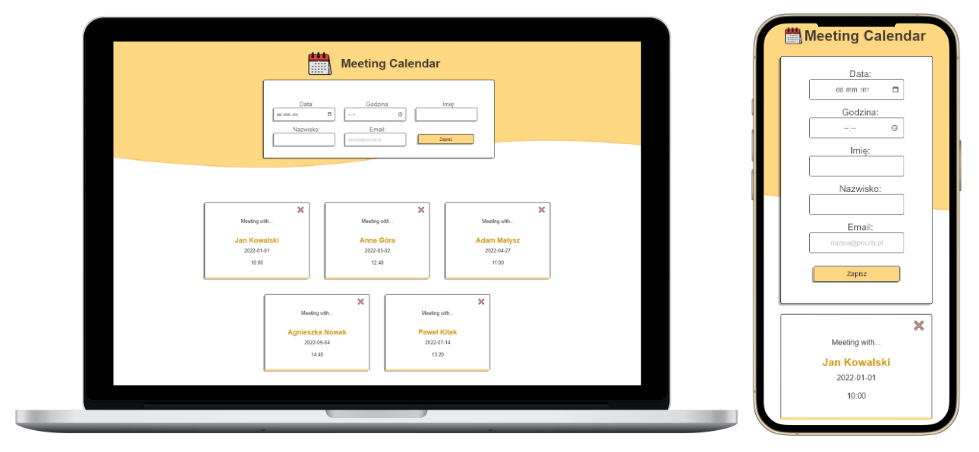

# Meeting Calendar :calendar:

In this project, the task was to create meeting calendar app, using React and Redux. New meetings are added using a form. There are stored in database - **API** running on **JSON Server**.  Details are presented below.

&nbsp;

 ## :hammer_and_pick: Technologies
 
 

&nbsp;

## :bulb: Projects opportunities:
 

-   **add meeting** with:
    -   name
    -   last name
    -   e-mail
    -   date
    -   time 
-  form fields are **validated** 
-  data is saved using **local API (JSON Server)**
-   **remove meetings**  
  

&nbsp;

## :gear: Installation

The project uses [node](https://nodejs.org/en/), [npm](https://www.npmjs.com/) and [JSON server](https://www.npmjs.com/package/json-server). 

To run it locally you should install all dependencies:

    npm i

To run webpack and create a localhost port you should type:

    npm start
    
To run JSON-server you should type in second terminal:

    json-server --watch ./src/db/data.json --port 3005
    
The calendar should be available at:

-  http://localhost:3000/

    
  &nbsp;  
    

## :envelope_with_arrow: Feel free to contact me
The project was made by Anna Królikowska

Find me on [**LINKEDIN**](https://www.linkedin.com/in/krolikowska-ann/) or [**GitHub**](https://github.com/annakrolikowska)
